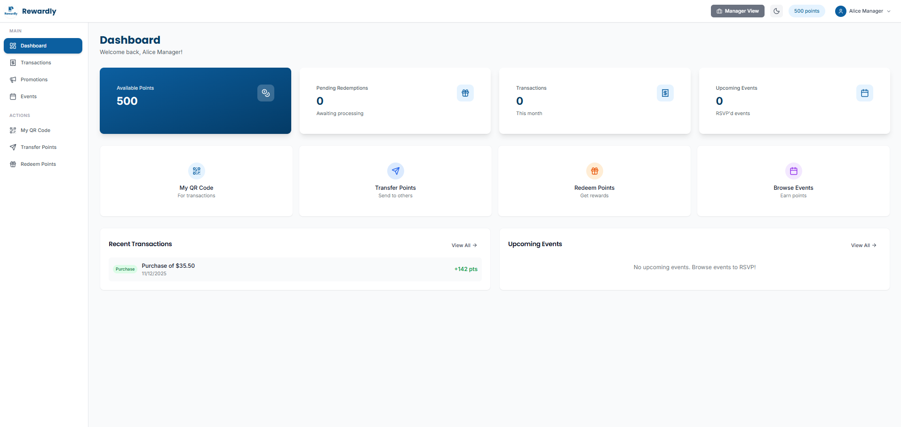
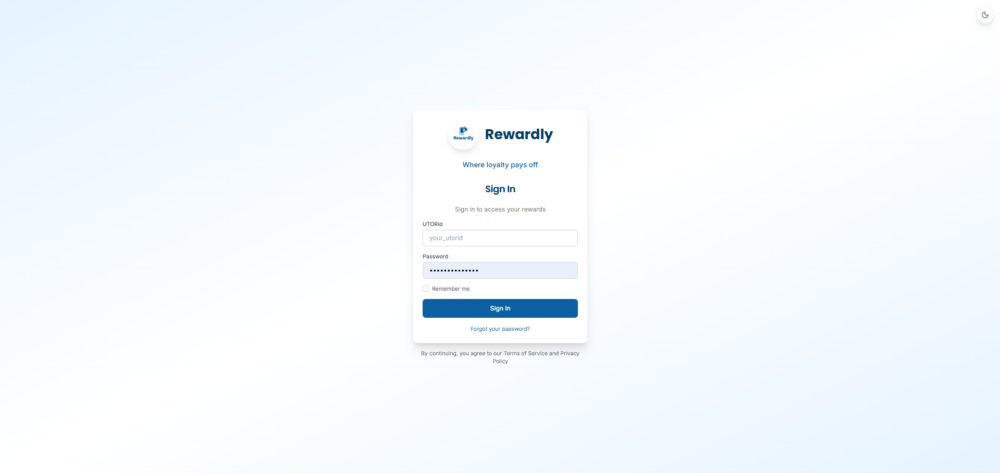
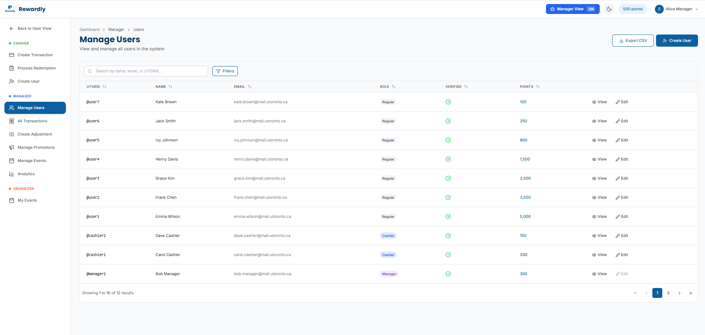
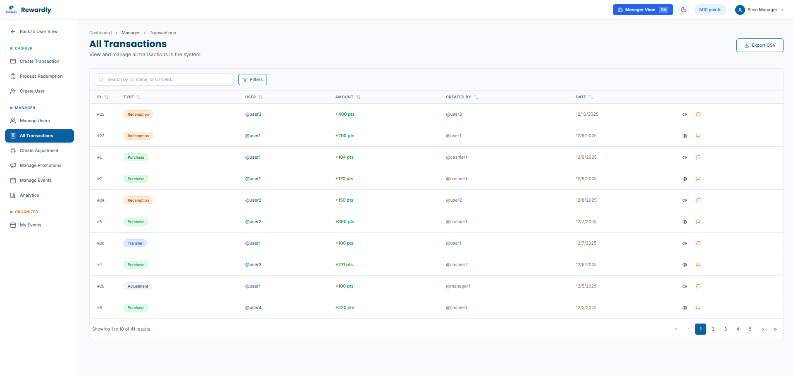
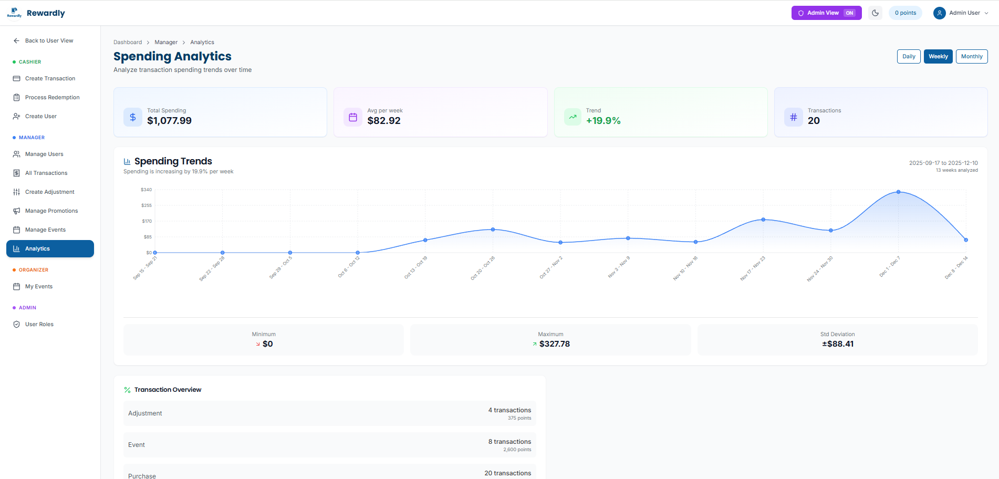
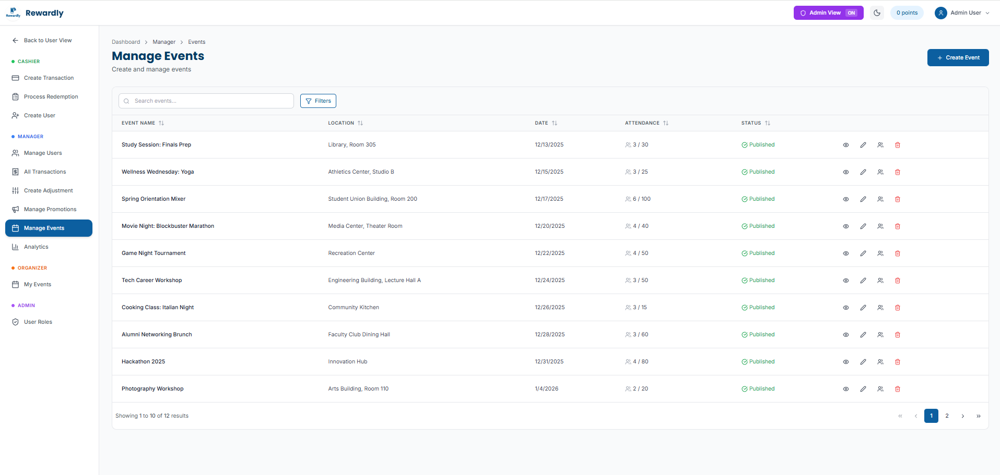
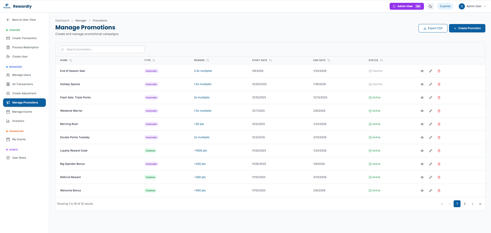
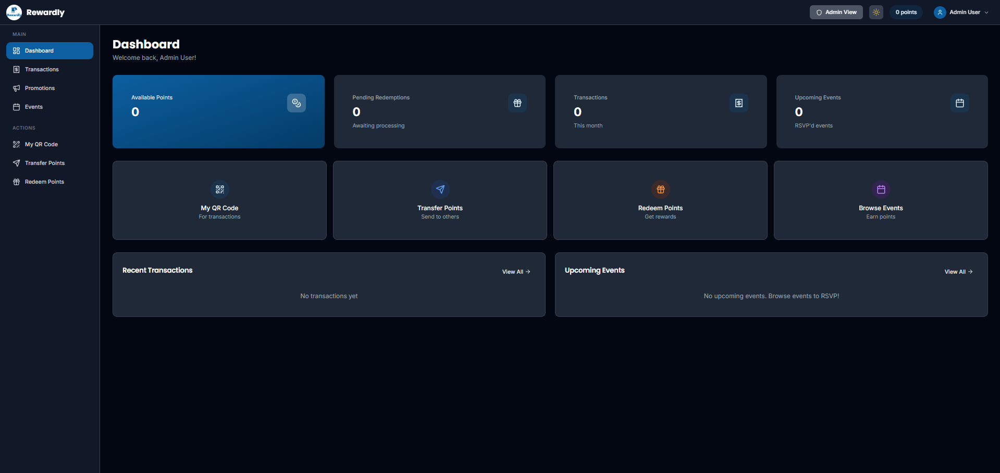

<div align="center">

# 🎁 Rewardly

### A Modern Loyalty Points Management System

[](https://developer.mozilla.org/en-US/docs/Web/JavaScript)
[](https://nodejs.org/)
[](https://reactjs.org/)
[](https://expressjs.com/)
[](https://prisma.io/)
[](https://sqlite.org/)
[](https://redis.io/)
[](https://tailwindcss.com/)
[](https://vitejs.dev/)
[](https://docker.com/)
[](https://sendgrid.com/)
[](https://jwt.io/)

[Features](#-features) • [Tech Stack](#-tech-stack) • [Getting Started](#-getting-started) • [Architecture](#-architecture) • [API](#-api-documentation)

---



</div>

---

## 📖 Overview

**Rewardly** is a full-stack loyalty points management system designed for businesses to reward customer engagement. Built with scalability and performance in mind, it features role-based access control, real-time analytics with trend analysis, event management, promotional campaigns, and Redis-powered caching.

This project demonstrates production-ready patterns including:
- **JWT Authentication** with hierarchical role-based permissions
- **Analytics Engine** with linear regression trend analysis
- **Redis Caching** for high-performance data retrieval (10x faster responses)
- **Rate Limiting** with distributed Redis-backed storage
- **Transactional Emails** via SendGrid integration
- **Modern UI** with dark mode support

---

## ✨ Features

### 🔐 Secure Authentication
Clean, modern login experience with JWT-based authentication. Users receive activation emails and can reset passwords securely.



**Authentication Flow:**
- Email-based account activation
- Secure password reset via email
- JWT tokens with 24-hour expiration
- Role-based dashboard redirection

---

### 👤 Multi-Role User Management
Hierarchical role system with **Superuser**, **Manager**, **Cashier**, and **Regular User** roles. Each role has granular permissions enforced at both API and UI levels.



**Capabilities:**
- Create and manage user accounts
- Role promotion/demotion with permission checks
- Account activation via email
- Suspicious user flagging

---

### 💰 Transaction Processing
Complete transaction lifecycle management supporting multiple transaction types with full audit trails.



**Transaction Types:**
- **Purchases** - Earn points on spending
- **Redemptions** - Redeem points for rewards
- **Adjustments** - Manager-initiated point corrections
- **Transfers** - Peer-to-peer point transfers
- **Event Awards** - Points for event attendance

---

### 📊 Spending Analytics Dashboard
Real-time spending trend analysis using **linear regression** with configurable time periods and statistical insights.



**Features:**
- Daily, weekly, and monthly trend analysis
- Linear regression with R² confidence scores
- Min/max spending with standard deviation
- Visual trend charts with historical data
- **Redis-cached** for instant repeat queries

---

### 🎉 Event Management
Create and manage events with RSVP tracking, capacity management, and automatic points distribution to attendees.



**Capabilities:**
- Event creation with capacity limits
- RSVP management and check-in
- Points pool distribution to attendees
- Organizer assignment
- Published/draft event states

---

### 🎁 Promotions Engine
Flexible promotion system supporting both automatic multipliers and one-time promo codes.



**Promotion Types:**
- **Automatic** - Applied automatically based on rules (e.g., 2x points on Tuesdays)
- **One-Time Codes** - Promo codes for bonus points (e.g., WELCOME500)

---

### 🌙 Dark Mode
Full dark mode support with automatic system preference detection and manual toggle.



---

## 🛠️ Tech Stack

### Frontend

| Technology | Purpose |
|------------|---------|
|  | UI library with hooks and functional components |
|  | Next-generation frontend build tool |
|  | Utility-first CSS framework |
|  | Client-side routing with protected routes |
|  | Data visualization for analytics |

### Backend

| Technology | Purpose |
|------------|---------|
|  | JavaScript runtime environment |
|  | Fast, minimalist web framework |
|  | Next-generation ORM for type-safe database access |
|  | Lightweight, serverless database |
|  | In-memory caching & distributed rate limiting |

### Security & Infrastructure

| Technology | Purpose |
|------------|---------|
|  | Stateless authentication tokens |
|  | Secure password hashing (10 salt rounds) |
|  | HTTP security headers |
|  | Transactional email delivery |
|  | Schema validation for API inputs |

---

## 🏗️ Architecture

```
┌─────────────────────────────────────────────────────────────────────┐
│                        Frontend (React + Vite)                       │
│  ┌──────────────┐  ┌──────────────┐  ┌────────────────────────────┐ │
│  │    Auth      │  │   Dashboard  │  │  Analytics / Events / ...  │ │
│  │   Context    │  │    Layout    │  │        Components          │ │
│  └──────────────┘  └──────────────┘  └────────────────────────────┘ │
└─────────────────────────────┬───────────────────────────────────────┘
                              │ REST API (JSON)
┌─────────────────────────────▼───────────────────────────────────────┐
│                       Backend (Express.js)                           │
│  ┌──────────────┐  ┌──────────────┐  ┌────────────────────────────┐ │
│  │    Routes    │──│  Controllers │──│         Services           │ │
│  │   (7 files)  │  │   (7 files)  │  │    (Business Logic)        │ │
│  └──────────────┘  └──────────────┘  └────────────┬───────────────┘ │
│                                                    │                  │
│  ┌──────────────┐  ┌──────────────┐  ┌────────────▼───────────────┐ │
│  │  Middleware  │  │     Auth     │  │       Repositories         │ │
│  │ (Rate Limit) │  │    (JWT)     │  │      (Data Access)         │ │
│  └──────┬───────┘  └──────────────┘  └────────────┬───────────────┘ │
└─────────┼─────────────────────────────────────────┼─────────────────┘
          │                                         │
    ┌─────▼─────┐                            ┌──────▼──────┐
    │   Redis   │                            │   SQLite    │
    │  (Cache)  │                            │ (Database)  │
    │           │                            │             │
    │ • Caching │                            │ • Users     │
    │ • Rate    │                            │ • Accounts  │
    │   Limits  │                            │ • Events    │
    └───────────┘                            └─────────────┘
```

### Redis Caching Strategy

Redis caching provides **10x faster response times** for frequently accessed data:

| Endpoint | Cache Key Pattern | TTL | Benefit |
|----------|-------------------|-----|---------|
| `GET /analytics/spending-trends` | `analytics:spending:{period}:{lookback}` | 10 min | Expensive regression calculations cached |
| `GET /analytics/stats` | `analytics:transaction-stats` | 5 min | Aggregate queries cached |
| Rate Limiting | `rl:general:{ip}`, `rl:auth:{ip}` | 15 min | Distributed across instances |

**Cache Flow:**
```
Request → Check Redis → Cache HIT? → Return cached data (instant)
                      → Cache MISS? → Query DB → Store in Redis → Return
```

---

## 🚀 Getting Started

### Prerequisites

- **Node.js** 18 or higher
- **npm** or yarn
- **Docker** (optional, for Redis)

### Quick Start

```bash
# Clone the repository
git clone https://github.com/HamedDawoudzai/Rewardly.git
cd Rewardly
```

#### Backend Setup

```bash
cd backend
npm install

# Initialize database
npx prisma generate
npx prisma migrate deploy
node prisma/seed-all.js

# Start Redis (recommended for caching)
docker run -d -p 6379:6379 --name redis redis

# Start the server
npm start
```

#### Frontend Setup

```bash
# In a new terminal
cd frontend
npm install
npm run dev
```

### Environment Configuration

Create `backend/.env`:

```env
# SendGrid (for emails)
SENDGRID_API_KEY=SG.your_api_key_here
FROM_EMAIL=your-email@domain.com

# Redis (optional - app works without it)
REDIS_URL=redis://localhost:6379

# Security
JWT_SECRET=your-super-secret-jwt-key

# CORS
FRONTEND_URL=http://localhost:5173
```

---

## 🔑 Demo Credentials

All demo accounts use the password: **`pass`**

| Role | Username | Email | Starting Points |
|------|----------|-------|-----------------|
| **Superuser** | `admin` | admin.user@mail.utoronto.ca | 0 |
| **Manager** | `manager1` | alice.manager@mail.utoronto.ca | 500 |
| **Manager** | `manager2` | bob.manager@mail.utoronto.ca | 300 |
| **Cashier** | `cashier1` | carol.cashier@mail.utoronto.ca | 200 |
| **Cashier** | `cashier2` | dave.cashier@mail.utoronto.ca | 150 |
| **Regular** | `user1` | emma.wilson@mail.utoronto.ca | 5,000 |
| **Regular** | `user2` | frank.chen@mail.utoronto.ca | 3,500 |
| **Regular** | `user3` | grace.kim@mail.utoronto.ca | 2,000 |

### Promo Codes

| Code | Bonus Points | Description |
|------|--------------|-------------|
| `WELCOME500` | 500 | New member bonus ($10 min spend) |
| `LOYAL1000` | 1,000 | Loyalty reward |
| `FIRST100` | 100 | First purchase bonus |
| `REFER300` | 300 | Referral reward |
| `BDAY500` | 500 | Birthday bonus |

---

## 📡 API Documentation

### Authentication

| Method | Endpoint | Description |
|--------|----------|-------------|
| `POST` | `/auth/tokens` | Login and receive JWT |
| `POST` | `/auth/resets` | Request password reset email |
| `POST` | `/auth/resets/:token` | Reset password with token |

### Users

| Method | Endpoint | Description | Auth |
|--------|----------|-------------|------|
| `GET` | `/users` | List all users | Manager+ |
| `POST` | `/users` | Create new user | Cashier+ |
| `GET` | `/users/me` | Get own profile | Any |
| `PATCH` | `/users/me` | Update own profile | Any |
| `GET` | `/users/:id` | Get user by ID | Manager+ |
| `PATCH` | `/users/:id` | Update user | Manager+ |

### Transactions

| Method | Endpoint | Description | Auth |
|--------|----------|-------------|------|
| `GET` | `/transactions` | List transactions | Varies |
| `POST` | `/transactions` | Create transaction | Cashier+ |
| `GET` | `/transactions/:id` | Get transaction | Varies |
| `PATCH` | `/transactions/:id/suspicious` | Flag suspicious | Manager+ |

### Analytics

| Method | Endpoint | Description | Auth |
|--------|----------|-------------|------|
| `GET` | `/analytics/spending-trends` | Spending trends with regression | Manager+ |
| `GET` | `/analytics/stats` | Transaction statistics | Manager+ |

**Query Parameters for Spending Trends:**
- `period`: `daily` | `weekly` | `monthly`
- `lookback`: Number of periods to analyze

### Events

| Method | Endpoint | Description |
|--------|----------|-------------|
| `GET` | `/events` | List events |
| `POST` | `/events` | Create event |
| `GET` | `/events/:id` | Get event details |
| `PATCH` | `/events/:id` | Update event |
| `DELETE` | `/events/:id` | Delete event |
| `POST` | `/events/:id/guests/:userId/award` | Award points |

### Promotions

| Method | Endpoint | Description |
|--------|----------|-------------|
| `GET` | `/promotions` | List promotions |
| `POST` | `/promotions` | Create promotion |
| `GET` | `/promotions/:id` | Get promotion |
| `PATCH` | `/promotions/:id` | Update promotion |
| `DELETE` | `/promotions/:id` | Delete promotion |

---

## 🔒 Security Features

| Feature | Implementation |
|---------|----------------|
| **Authentication** | JWT tokens with 24-hour expiration |
| **Password Security** | bcrypt hashing with 10 salt rounds |
| **Rate Limiting** | Redis-backed distributed limiting |
| | • General API: 10,000 req / 15 min |
| | • Auth endpoints: 500 req / 15 min |
| **Security Headers** | Helmet.js (XSS, clickjacking, MIME sniffing) |
| **Input Validation** | Zod schemas on all endpoints |
| **CORS** | Whitelist-based origin validation |
| **SQL Injection** | Prevented via Prisma ORM |

---

## 📈 Performance Optimizations

| Optimization | Impact |
|--------------|--------|
| **Redis Caching** | 10x faster analytics responses on cache hits |
| **Database Indexing** | Optimized queries via Prisma indexes |
| **Connection Pooling** | Efficient database connection management |
| **Lazy Loading** | React components loaded on demand |
| **Gzip Compression** | Reduced payload sizes |

---

## 🧪 Testing

```bash
# Run all tests
cd backend
npm test

# Run with coverage
npm run test:coverage

# Run integration tests
npm run test:integration
```

---

## 📁 Project Structure

```
Rewardly/
├── backend/
│   ├── src/
│   │   ├── controllers/     # Request handlers
│   │   ├── services/        # Business logic
│   │   ├── repositories/    # Data access layer
│   │   ├── middleware/      # Auth, rate limiting
│   │   ├── routes/          # API route definitions
│   │   └── utils/           # Helpers (JWT, Redis, validation)
│   ├── prisma/
│   │   ├── schema.prisma    # Database schema
│   │   ├── migrations/      # Database migrations
│   │   └── seed-all.js      # Demo data seeder
│   └── test/                # Integration tests
│
├── frontend/
│   ├── src/
│   │   ├── components/      # Reusable UI components
│   │   ├── pages/           # Route pages
│   │   ├── context/         # React contexts
│   │   ├── hooks/           # Custom hooks
│   │   └── api/             # API client functions
│   └── public/              # Static assets
│
└── docs/
    └── images/              # README screenshots
```

---

## 🤝 Contributing

1. Fork the repository
2. Create a feature branch (`git checkout -b feat/amazing-feature`)
3. Commit your changes (`git commit -m 'feat: add amazing feature'`)
4. Push to the branch (`git push origin feat/amazing-feature`)
5. Open a Pull Request

---

## 📄 License

This project is licensed under the MIT License - see the [LICENSE](LICENSE) file for details.

---

<div align="center">

### Built with ❤️ by

[Hamed Dawoudzai](https://github.com/HamedDawoudzai) • [Brandan Burgess](https://github.com/BrandanBurgess) • [Anuj Sarvate](https://github.com/AnujSarvate)

**[⬆ Back to Top](#-rewardly)**

</div>
